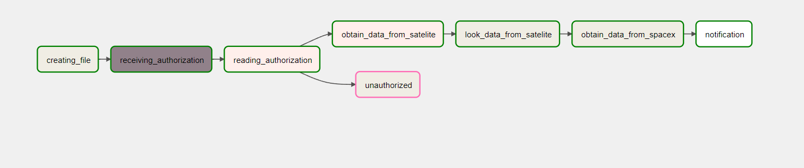

# Capstone Project for the Platzi-Airflow-Course
- [Capstone Project for the Platzi-Airflow-Course](#capstone-project-for-the-platzi-airflow-course)
  - [Install Airflow](#install-airflow)
  - [Project Statement](#project-statement)
  - [DAGs](#dags)
    - [proyecto.py](#proyectopy)
    - [notifications.py](#notificationspy)
  - [Final Structure](#final-structure)
  - [Tasks' explanation.](#tasks-explanation)
## Install Airflow
You need Docker in order to to this
```
curl -LfO 'https://airflow.apache.org/docs/apache-airflow/2.3.3/docker-compose.yaml'
mkdir -p ./dags ./logs ./plugins
echo -e "AIRFLOW_UID=$(id -u)" > .env
docker-compose up airflow-ini- [Capstone Project for the Platzi-Airflow-Course](#capstone-project-for-the-platzi-airflow-course)
  - [Install Airflow](#install-airflow)
  - [Project Statement](#project-statement)
  - [DAGs](#dags)
    - [Proyecto.py](#proyectopy)
    - [notifications.py](#notificationspy)
  - [Final Structure](#final-structure)
  - [Tasks' explanation.](#tasks-explanation)
t
docker-compose up
```
If you don't want to see the examples, you'll set up AIRFLOW__CORE__LOAD_EXAMPLES to false.

## Project Statement
The project is to create a data pipeline that will allow us to download data from a satelite and from spacex only if we receive an authorization from the NASA.

You can read more about it [here](project_statement.pdf).

## DAGs
### proyecto.py
This DAG will orchestrate all the project.
### notifications.py
This DAG will send a notification to the user if the process finished.

## Final Structure


## Tasks' explanation.
1. creating_file: This task creates a file that will receive the authorization or not.
2. receiving_authorization: A File Sensor that waits until the authorization is created.
3. reading_authorization: If we receive the value `authorized` we will download the data, otherwise we finished our pipeline.
4. obtain_data_from_satelite: obtain data from a python script.
5. look_data_from_satelite: shows some data from the previous task.
6. obtain_data_from_spacex: download data from spacex using a Bash Operator.
7. notification: sends a notification to the team
8. unauthorized: If we don't receive the value `authorized`, we will use this task to a send a message to our team. 